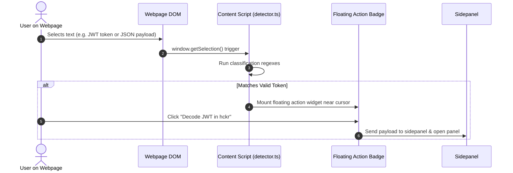

# 🔍 Content Scripts & Detector

The content script (`src/content/detector.ts` and `src/content/widget.css`) runs in the context of open webpages to identify developer data structures on the fly.

## Token Detection Lifecycle

---

## Token Classifiers

1. **JSON Detector**: Checks for balanced braces `{ ... }` or `[ ... ]` and runs a fast parse check.
2. **JWT Detector**: Evaluates `^[A-Za-z0-9-_=]+\.[A-Za-z0-9-_=]+\.?[A-Za-z0-9-_.+/=]*$` structure.
3. **Base64 String**: Validates standard base64 alphabet with padding checks.
4. **Unix Timestamp**: Identifies 10-digit (seconds) or 13-digit (milliseconds) numerical strings within reasonable epoch boundaries.

---

## Non-Intrusive Widget Styling

The badge is injected inside a Shadow DOM or scoped container with `widget.css` to prevent conflicts with host page styles, featuring:
- Z-index safety
- Auto-dismiss on click outside or document scroll
- Keyboard dismiss via `Escape`
