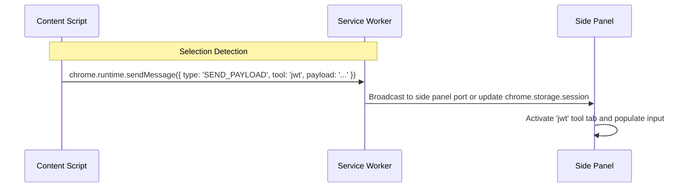

# 💬 Messaging & IPC Protocol

Chrome extensions isolate execution contexts (Content Scripts, Service Worker, Side Panel). Communication flows through type-safe message envelopes.

## Message Schemas

All message types are defined under `src/shared/types.ts`:

```typescript
export type MessageType =
  | 'OPEN_TOOL'
  | 'SEND_PAYLOAD'
  | 'DETECTION_TRIGGER'
  | 'GET_TAB_HISTORY'
  | 'TOOL_SWITCHED';

export interface ExtensionMessage<T = unknown> {
  type: MessageType;
  toolId?: string;
  payload?: T;
  source?: 'content' | 'sidepanel' | 'background';
  timestamp: number;
}
```

---

## Message Flow Diagram



---

## Storage vs. Direct Port Dispatch

- **Direct Messages (`chrome.runtime.sendMessage`)**: Used when the side panel is currently mounted and active.
- **Session Storage (`chrome.storage.session`)**: Used as a fallback when the sidepanel is closed. The service worker persists the pending payload, calls `chrome.sidePanel.open()`, and the side panel consumes the pending payload upon mount.
