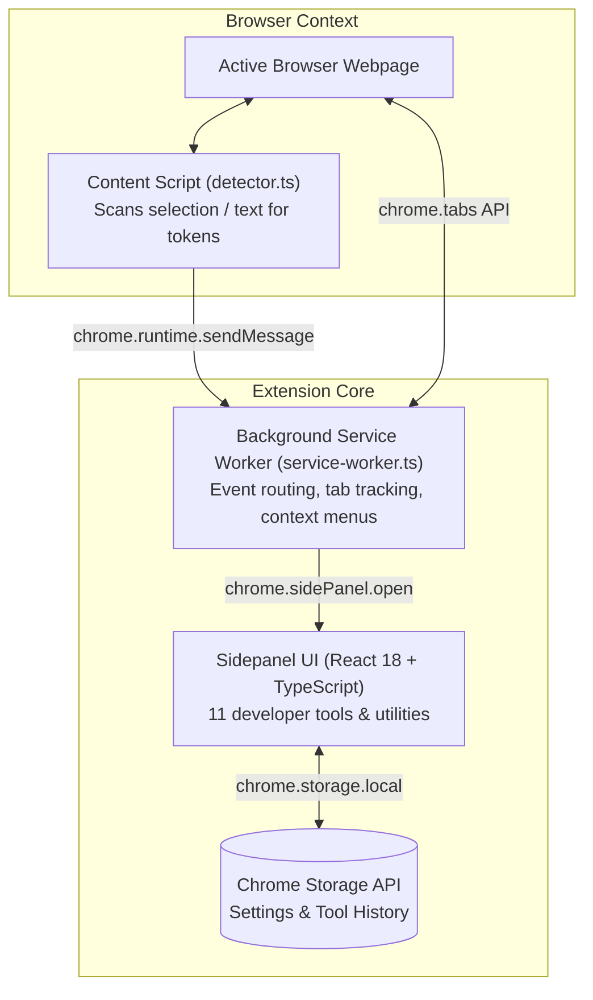

# 🏛️ Architecture Overview

The `hckr` browser extension is built strictly on **Chrome Extensions Manifest V3 (MV3)** APIs and utilizes a modern modular React + Vite architecture.

## System Topology

---

## Key Modules

### 1. Side Panel Application (`src/sidepanel/`)
- Built with React 18 and standard CSS modules.
- Docked side panel UI that stays open alongside web development workflows.
- Contains the tool registry with 11 specialized utilities.
- Quick navigation search bar to switch tools with fuzzy matching.

### 2. Background Service Worker (`src/service-worker.ts`)
- Stateless background worker spawned on-demand by Chrome.
- Manages `chrome.contextMenus` for sending highlighted text directly to formatting/decoding tools.
- Tracks active tab history for `Alt+Q` fast tab switching command.
- Controls sidepanel open/close behavior.

### 3. Content Detector Script (`src/content/`)
- Injected on `document_idle` across web pages.
- Inspects user text selection or page content to detect strings matching:
  - JSON objects and arrays
  - JWT authorization tokens (`ey...`)
  - Base64 encoded strings
  - Unix timestamps (seconds & milliseconds)
- Displays a small floating non-intrusive action badge allowing instant 1-click inspection in the sidepanel.

### 4. Shared Protocol & Types (`src/shared/`)
- Type-safe message definitions (`ActionMessage`, `DetectorMessage`).
- Storage keys and preference defaults.
- Format detection algorithms and validation regexes.
