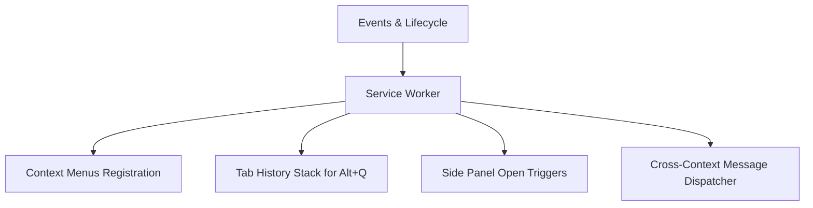

# ⚙️ Service Worker Internals

The background script in `src/service-worker.ts` acts as the event-driven coordinator for the entire extension lifecycle.

## Responsibilities



---

## 1. Context Menus Management

On `chrome.runtime.onInstalled`, the service worker sets up contextual items:

```typescript
chrome.runtime.onInstalled.addListener(() => {
  chrome.contextMenus.create({
    id: 'hckr-root',
    title: 'hckr Dev Toolkit',
    contexts: ['selection']
  });

  chrome.contextMenus.create({
    parentId: 'hckr-root',
    id: 'hckr-json',
    title: 'Format as JSON',
    contexts: ['selection']
  });

  chrome.contextMenus.create({
    parentId: 'hckr-root',
    id: 'hckr-jwt',
    title: 'Decode JWT',
    contexts: ['selection']
  });

  chrome.contextMenus.create({
    parentId: 'hckr-root',
    id: 'hckr-base64',
    title: 'Base64 Decode',
    contexts: ['selection']
  });
});
```

When clicked, the payload is forwarded to the active tab's side panel via storage or runtime messaging.

---

## 2. Fast Tab Switching (`Alt+Q`)

Tracks the user's active tab transitions using a 2-element stack:

```typescript
let activeTabId: number | null = null;
let previousTabId: number | null = null;

chrome.tabs.onActivated.addListener((activeInfo) => {
  if (activeTabId !== null && activeTabId !== activeInfo.tabId) {
    previousTabId = activeTabId;
  }
  activeTabId = activeInfo.tabId;
});

chrome.commands.onCommand.addListener(async (command) => {
  if (command === 'switch-to-previous-tab' && previousTabId !== null) {
    try {
      await chrome.tabs.update(previousTabId, { active: true });
    } catch {
      // Tab may have been closed
      previousTabId = null;
    }
  }
});
```

---

## 3. Side Panel Trigger

On clicking the extension toolbar icon (`chrome.action.onClicked`):

```typescript
chrome.action.onClicked.addListener(async (tab) => {
  if (tab.id) {
    await chrome.sidePanel.open({ tabId: tab.id });
  }
});
```
