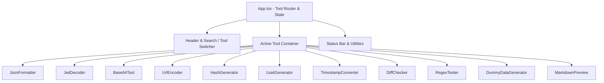

# 🖥️ Sidepanel UI Architecture

The side panel UI (`src/sidepanel/`) is a single-page React 18 application docked directly into Google Chrome's native side panel container.

## Component Hierarchy

---

## State Persistence

Active tool state and text inputs persist in `chrome.storage.local` or session memory:

- When switching between tools, the active tab preserves drafts and output states.
- The last active tool ID is stored under key `hckr_last_tool` so reopening the side panel returns directly to the developer's previous task.

---

## Theming & Design System

The application uses CSS custom properties defined in `src/sidepanel/styles/` with a high-contrast dark cyberpunk palette:

- **Backgrounds**: `#0d1117`, `#161b22`, `#21262d`
- **Accents**: Neon Cyan (`#00e5ff`), Emerald (`#00f08a`), Magenta (`#f72585`)
- **Typography**: Monospace default for all inputs, outputs, and diff displays.
- **Copy Utility**: Built-in clipboard helper with instant animated feedback badge.
