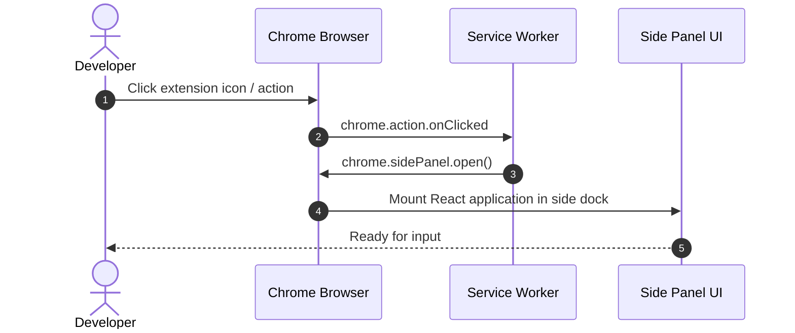

# 🔌 Loading the Unpacked Extension in Chrome

To test the extension locally in Google Chrome or any Chromium-based browser (Brave, Edge, Arc):

## Step-by-Step Instructions

1. **Build the extension**:
   ```bash
   make build
   ```
   Ensure the `dist/` directory exists and contains `manifest.json`, `service-worker.js`, and `content/`.

2. **Open Extensions Manager in Chrome**:
   - Navigate to `chrome://extensions` in your address bar.
   - Or open the Chrome Menu (`⋮`) -> **Extensions** -> **Manage Extensions**.

3. **Enable Developer Mode**:
   - Toggle the **Developer mode** switch in the top-right corner of `chrome://extensions`.

4. **Load Unpacked**:
   - Click the **Load unpacked** button in the top-left toolbar.
   - Select the `dist/` directory inside this repository (`/path/to/hckr-tools-browser-extension/dist`).

5. **Pin and Open**:
   - Click the Puzzle icon in Chrome's toolbar to find **hckr — Dev Toolkit**.
   - Pin it to the toolbar for 1-click access to the Side Panel.



## Reloading Changes

When running `make dev`, Vite will re-bundle files upon every save. To see changes in Chrome:
- For **Side Panel React code**: Simply close and reopen the side panel, or right-click within the panel and click **Inspect -> Reload**.
- For **Service Worker or Content Scripts**: Click the **Reload (↺)** icon on the extension card in `chrome://extensions`.
