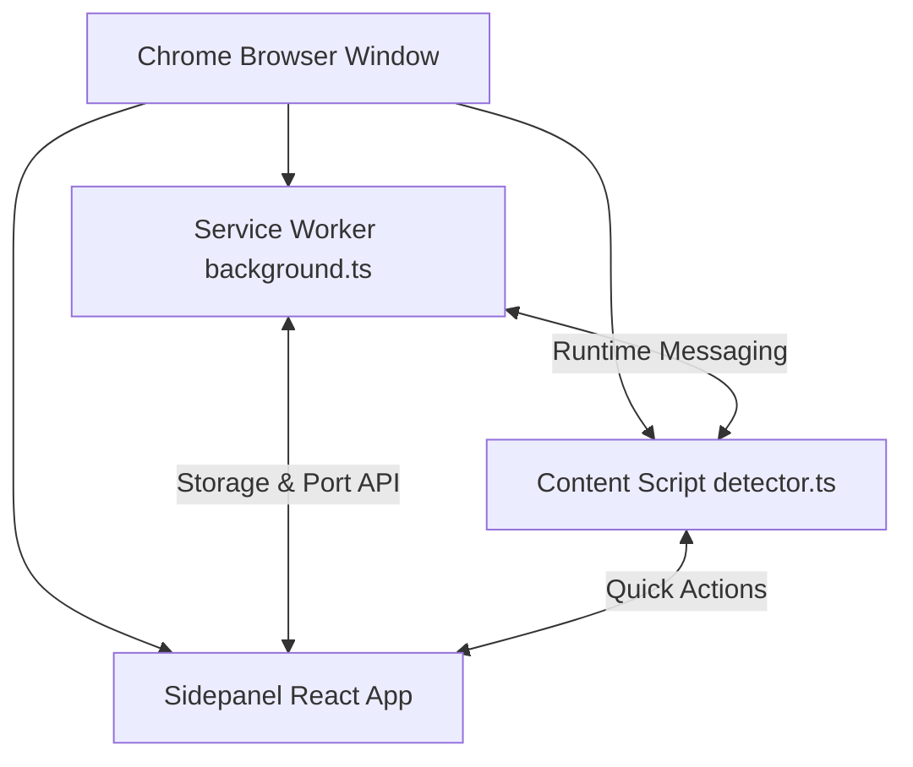

# `hckr` Developer Documentation

Welcome to the internal engineering and architecture documentation for **`hckr`** — an offline, privacy-first Chrome Extension delivering **11 developer utilities** right within your browser sidepanel and active webpages.

---

## ⚡ Quick Navigation

| Section | Focus Area | Key Docs |
| :--- | :--- | :--- |
| 🚀 **Getting Started** | Setup, builds, and loading unpacked extension | [Quickstart](/devdocs/getting-started/quickstart/), [Local Setup](/devdocs/getting-started/local-setup/) |
| 🏗️ **Architecture & MV3** | Service Worker, Sidepanel UI, Content Scripts, IPC | [Overview](/devdocs/architecture/overview/), [Manifest V3](/devdocs/architecture/manifest-v3/) |
| 🛠️ **Tools Catalog** | 11 built-in developer tools and formatters | [Tools Overview](/devdocs/tools/overview/), [JSON Formatter](/devdocs/tools/json-formatter/) |
| 🧪 **Testing & Quality** | Playwright E2E testing and typechecking | [E2E Testing](/devdocs/testing/e2e-playwright/), [Linting](/devdocs/testing/linting/) |
| ⚡ **Workflows & Commands**| Make targets, watch mode, tmux multi-pane dev | [Make Commands](/devdocs/workflows/make-commands/), [Tmux Setup](/devdocs/workflows/dev-tmux/) |
| 📦 **Release & Publish** | Chrome Web Store packaging and compliance | [Packaging](/devdocs/release/packaging/), [Web Store Guide](/devdocs/release/chrome-web-store/) |

---

## 🔒 Core Principles

1. **100% Offline & Private**: Zero external telemetry, zero analytics tracking, zero third-party network requests. All parsing, hashing, decoding, and formatting runs locally in the client.
2. **Instant Accessibility**: Docked side panel UI with instant keyboard access (`Alt+Q` fast tab switching, context menus, and inline page token detection).
3. **High Performance**: Built with React 18 and Vite for sub-millisecond tab switching and minimal memory footprint.
