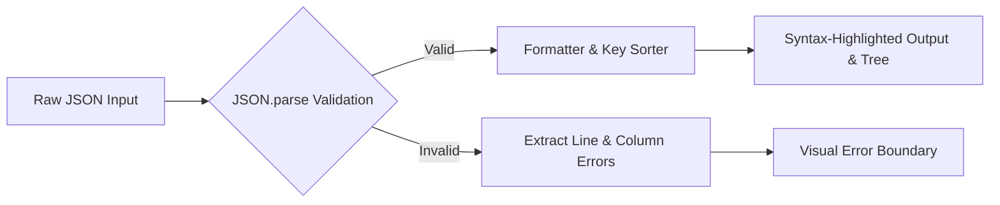

# 🗄️ JSON Formatter & Validator

**Component**: `src/sidepanel/tools/JsonFormatter.tsx`  
**Styles**: `src/sidepanel/tools/JsonFormatter.css`

## Overview

A high-performance JSON formatting, linting, minification, and inspection tool designed to handle large JSON responses effortlessly.

## Key Capabilities

1. **Prettify**: Format unstructured JSON with customizable indentation (2 spaces, 4 spaces, or Tabs).
2. **Minify**: Strip all unnecessary whitespace for compact network payloads.
3. **Sort Keys**: Alphabetically order object keys recursively for consistent comparisons.
4. **Syntax Error Pointer**: Pinpoint exact line and character positions of syntax errors with helpful error messages.
5. **Stats & Metrics**: Live counters showing byte size, character count, depth, and total node count.
6. **1-Click Actions**: Instant copy, clear, and download as `.json`.

